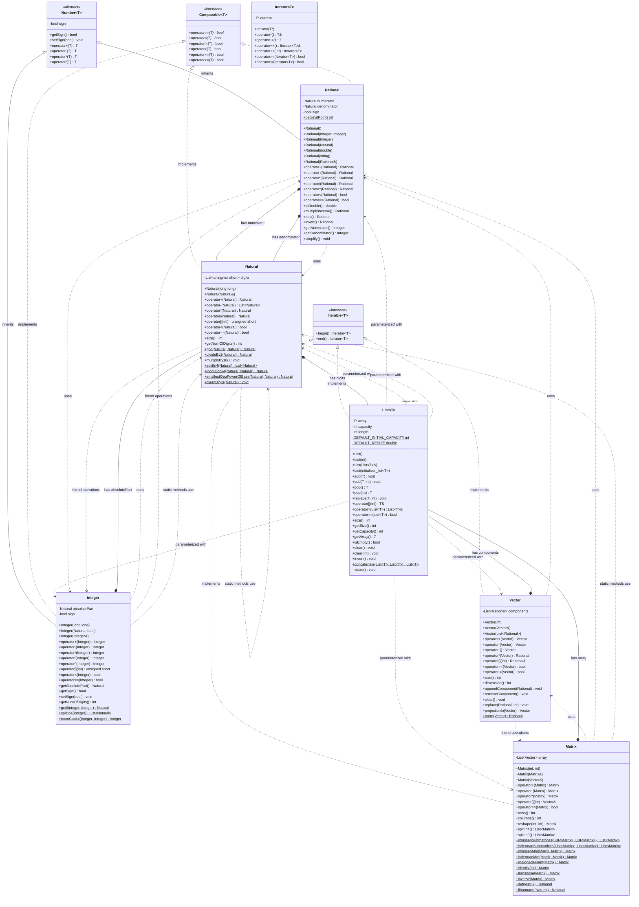

# Class diagram

## Class Relationships Explanation

### Inheritance Hierarchy (is-a)
- **Integer** and **Rational** inherit from **Number<T>** abstract base class
- **Natural**, **Integer**, **Rational** implement **Comparable<T>** interface
- **Vector**, **Matrix**, **List<T>** implement **Iterable<T>** interface

### Composition Relationships (has-a)
- **Integer** has a **Natural** (absolutePart) for magnitude
- **Rational** has two **Natural** objects (numerator, denominator)
- **Natural** has a **List<unsigned short>** (digits) for storage
- **Vector** has a **List<Rational>** (components) for elements
- **Matrix** has a **List<Vector>** (array) for rows

### Template Specializations
- **List<T>** is specialized for various types:
  - `List<Rational>` for Vector components
  - `List<Vector>` for Matrix rows
  - `List<unsigned short>` for Natural digits
  - `List<Natural>` and `List<Integer>` for algorithm results
  - `List<Matrix>` for matrix decomposition algorithms

### Design Patterns
1. **Template Pattern**: List<T> and Number<T> are generic containers/interfaces
2. **Composition Pattern**: Complex types built from simpler ones
3. **CRTP (Curiously Recurring Template Pattern)**: Used in Comparable<T> and Number<T>
4. **Iterator Pattern**: All containers provide begin()/end() for range-based loops
5. **Static Factory Methods**: Matrix provides static methods for special matrices
6. **Friend Functions**: Extensive use of friend operators for natural syntax

### Algorithm Implementations
- **Strassen** and **Laderman** algorithms for fast matrix multiplication
- **Toom-Cook 4-way** algorithm for fast integer multiplication
- **GCD algorithms** for Natural and Integer types
- **Matrix operations**: transpose, inverse, determinant, identity creation

### Stream Support
All major classes support iostream operations with overloaded `<<` and `>>` operators for easy input/output.

